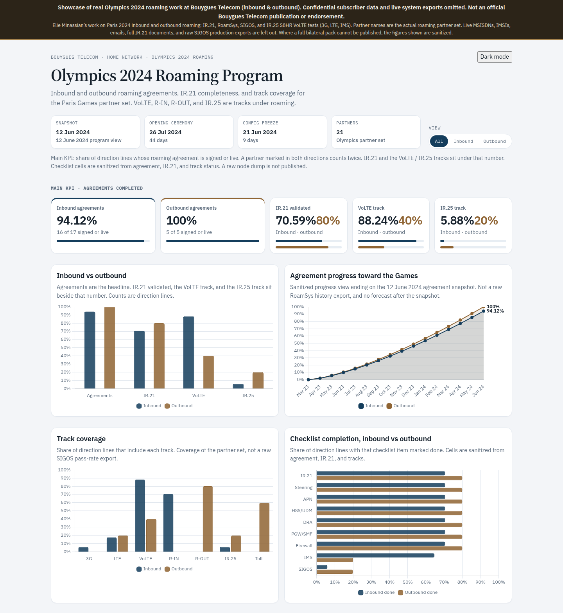
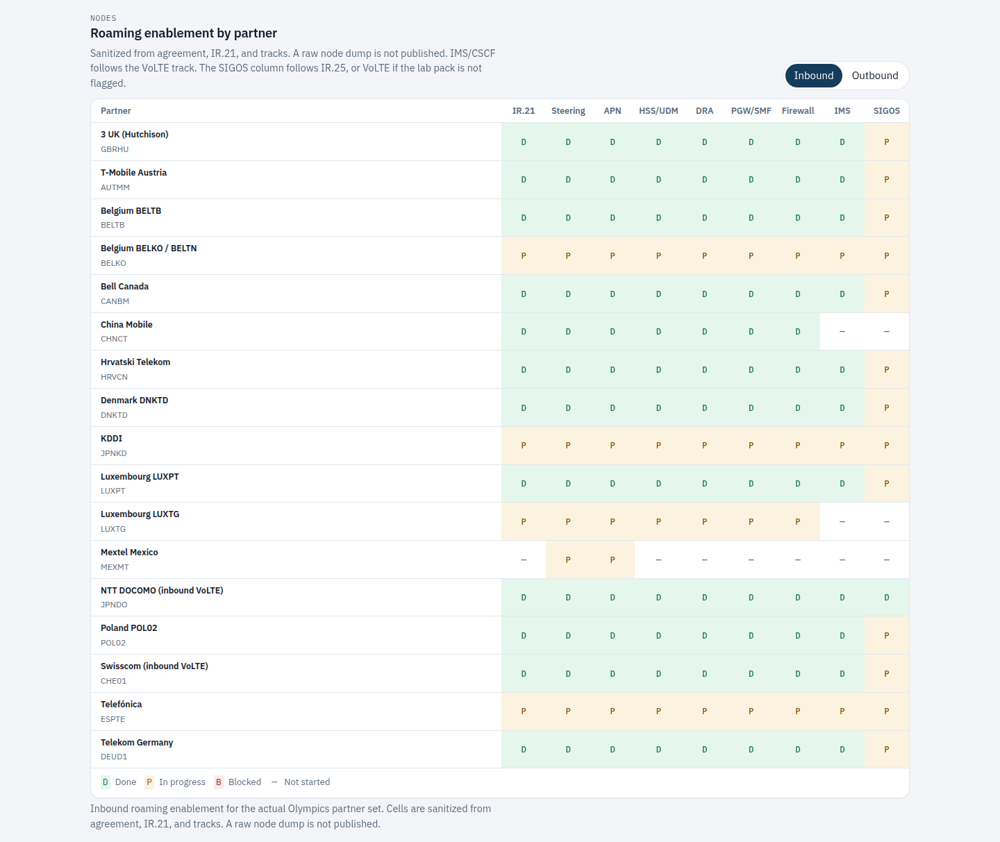
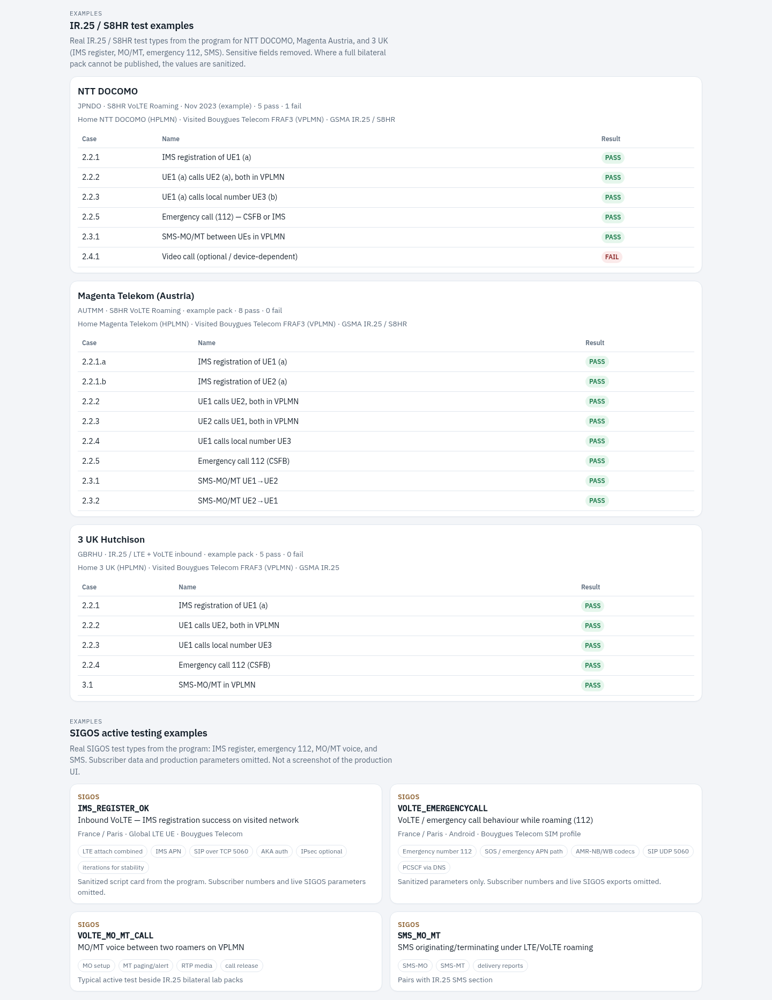
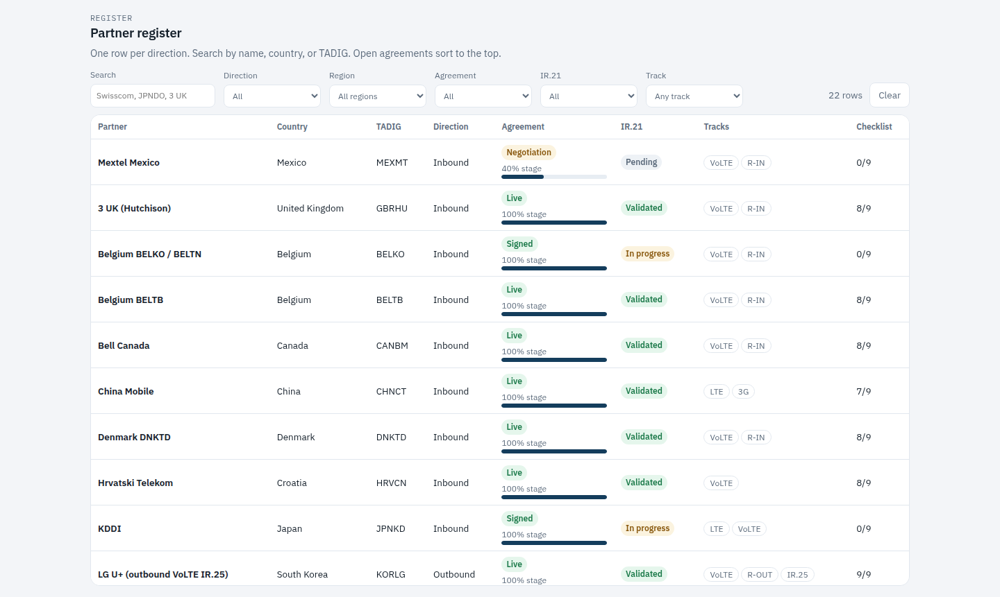

# Olympics 2024 Roaming Program

Showcase of real Olympics 2024 roaming work at Bouygues Telecom (inbound & outbound). Confidential subscriber data and live system exports omitted. Not an official Bouygues Telecom publication or endorsement.

## Live dashboard

**https://e-mination.github.io/paris-olympics-2024-roaming-volte/**

Elie Minassian did this work at **Bouygues Telecom** on **Paris 2024 inbound and outbound roaming**: IR.21, RoamSys, SIGOS, and IR.25 S8HR VoLTE tests (3G, LTE, IMS). Open the link for the graphs and stats. Nothing to install. The screenshots below are the same board.

Partner names are the **actual roaming partner set** from that program. The IR.25 tables and SIGOS cards are the **real test types** from the work (IMS register, emergency 112, MO/MT, SMS), with sensitive fields removed. Live MSISDNs, IMSIs, emails, full IR.21 documents, and raw SIGOS production exports are omitted. Where a full bilateral pack or a precise live figure cannot be published, the values shown are sanitized.

This is a personal portfolio showcase. It is **not an official Bouygues Telecom publication or endorsement**, and it does not use a Bouygues logo.



## Thirty-second read

At the **12 June 2024** snapshot (44 days before the Opening Ceremony, 9 days before configuration freeze):

| | Inbound | Outbound |
| --- | ---: | ---: |
| Agreements signed or live | **16 / 17 · 94.12%** | **5 / 5 · 100%** |
| IR.21 validated | **12 / 17 · 70.59%** | **4 / 5 · 80%** |
| VoLTE track | **15 / 17** | **2 / 5** |

Counts are direction lines across 21 partners from the program. Telefónica is in both directions. LG U+, NTT DOCOMO, and Swisscom keep separate inbound and outbound lines where the program did. VoLTE, R-IN, R-OUT, toll, and IR.25 are tracks under roaming, not a separate product. The monthly curve is a sanitized view that ends at this snapshot. It is not a raw RoamSys history export.

```
Olympics 2024 Roaming Program
Bouygues Telecom · home network · Paris 2024 roaming
Snapshot 12 Jun 2024 · freeze in 9 days · Opening Ceremony in 44 days

Inbound agreements     Outbound agreements     IR.21
94.12%   16/17         100%     5/5            70.59% · 80%

[ grouped bars: agreements, IR.21, VoLTE, IR.25 ]
[ line: both directions through Jun 2024        ]
[ track coverage: 3G LTE VoLTE R-IN R-OUT IR.25 toll ]
[ heatmap: sanitized checklist, actual partner names ]
[ IR.25: DOCOMO, Magenta, 3 UK ]
[ SIGOS cards: IMS register, 112, MO/MT, SMS ]
```







## What this shows

1. **Agreement completion** — percent of partner operators with a roaming agreement signed or live, split by inbound and outbound, with a monthly curve up to the snapshot.
2. **IR.21 completeness** — validated, in progress, or pending. Full RAEX documents are omitted.
3. **Roaming enablement on the core** — per partner: IR.21, steering, APN, HSS/UDM, DRA/STP, PGW/SMF, firewall, IMS/CSCF (VoLTE track), and SIGOS. Cells are sanitized from agreement, IR.21, and track status: done, in progress, blocked, or not started. A raw node dump is not published.
4. **Tracks** — 3G, LTE, VoLTE, R-IN, R-OUT, IR.25, and toll coverage by direction, plus IR.25 case tables (NTT DOCOMO, Magenta Austria, 3 UK) and SIGOS script cards from the work, with sensitive fields removed.
5. **The path to the Games** — planning, agreements, IR.21, lab, node config, configuration freeze, Olympic Games, Paralympic Games.

The register filters by name, country, TADIG, direction, region, agreement (open or completed), IR.21, and track. Open agreements sort to the top.

## Role

**Elie Minassian · Bouygues Telecom (Olympics 2024 Roaming)**

On the Paris 2024 roaming program at Bouygues Telecom, the work was project-style coverage of core network and services: follow inbound and outbound agreement progress with partner operators, IR.21 exchange and validation, roaming enablement on the core nodes, and active test campaigns. RoamSys was the system of record for the agreement footprint and IR.21 workflow. SIGOS was the active-test platform for 3G, LTE, VoLTE, and IMS, in both directions.

This repository is a portfolio showcase of that real work. Partner names and TADIGs are the actual roaming partner set. Checklist figures are sanitized. IR.25 results and SIGOS script cards are the real test types, with confidential fields removed.

Contact: [minassianelie@gmail.com](mailto:minassianelie@gmail.com) · GitHub: [e-mination](https://github.com/e-mination)

## What is published

| Published | Omitted (confidential) |
| --- | --- |
| Elie Minassian’s real work at Bouygues Telecom on Paris 2024 inbound and outbound roaming | Live MSISDNs, IMSIs, and program emails |
| The actual partner names and TADIGs from that program | Full IR.21 / RAEX documents |
| Agreement, IR.21, and track status used to steer the program | Raw SIGOS production exports and live parameter dumps |
| IR.25 and SIGOS test types from the work, with sensitive fields removed | Raw core-node configuration dumps |

There are no IP addresses and no IR.21 document bodies. The snapshot date is fixed at 12 June 2024 so the countdown still points at the Games. It is not a clock that runs from today. Where a precise live KPI or a full bilateral pack cannot be published, the page shows sanitized values and says so.

## Tools

**RoamSys** is a roaming-management platform operators use for the partner footprint and for GSMA RAEX document exchange: IR.21 distribution and receipt, roaming-agreement coverage, and IREG workflows that turn document changes into configuration follow-up. On this program it was where agreement stage and IR.21 completeness were followed. This public page is not connected to a RoamSys tenant. Product reference: [roamsys.com](https://roamsys.com/).

**SIGOS** (the SITE test system, and the hosted GlobalRoamer service, now part of Mobileum) is an active-testing platform. Probes run end-to-end roaming tests inbound and outbound. The four cards on the dashboard (IMS register, emergency 112, MO/MT voice, SMS) are the real script types from the work, with subscriber data and production parameters omitted. They are not screenshots of the production UI. Product reference: [GlobalRoamer](https://www.mobileum.com/ecosystems/globalroamer).

## Local development

The published board is the live dashboard above. To run a copy on your machine, serve the repo root (opening `index.html` as a file will not load the JSON):

```bash
python3 -m http.server 8080
```

Then open http://localhost:8080. Optional check of the snapshot figures: `python3 scripts/summarize.py --check`.

GitHub Pages already deploys `main` from the repository root (`index.html`, `css/`, `js/`, `data/`). Charts load Chart.js from the CDN; the figures load from the relative path `data/program.json`.

## Data

`data/enrichment.json` is the partner set with confidential fields removed. `data/program.json` is what the page loads. `python3 scripts/summarize.py --write` rebuilds the latter from the former.

- `partners[]` — name, country, TADIG, directions, tracks, IR.21, agreement, and a sanitized `nodes` checklist.
- `ir25_test_examples[]` — IR.25 / S8HR cases from the work for NTT DOCOMO, Magenta Austria, and 3 UK, with sensitive fields removed.
- `sigos_examples[]` — script cards from the work: `IMS_REGISTER_OK`, `VOLTE_EMERGENCYCALL`, `VOLTE_MO_MT_CALL`, `SMS_MO_MT`.
- `nodes` is nine characters in checklist order. `D` done, `P` in progress, `B` blocked, `N` not started.
- `progress[]` is a sanitized monthly curve of **agreements completed**. The last point is June 2024 and must match the direction-line count. It is not a raw RoamSys export.

Completed means `signed` or `live`.

```json
{
  "id": "gbr-3uk",
  "name": "3 UK (Hutchison)",
  "tadig": "GBRHU",
  "directions": ["inbound"],
  "tracks": ["VoLTE", "R-IN"],
  "ir21_status": "validated",
  "agreement_status": "live"
}
```

## Tech stack

- One static page: HTML, CSS, and vanilla JavaScript
- [Chart.js 4](https://www.chartjs.org/) from a CDN
- Local JSON, no backend
- Python 3 script to recompute and check the snapshot
- A small GitHub Actions workflow that runs that check

License: [MIT](LICENSE).

Elie Minassian · Bouygues Telecom (Olympics 2024 Roaming) · minassianelie@gmail.com
